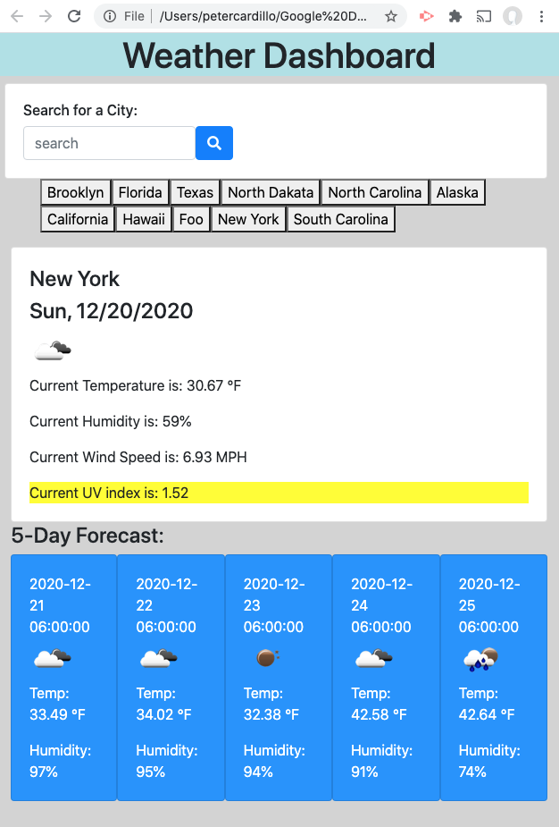
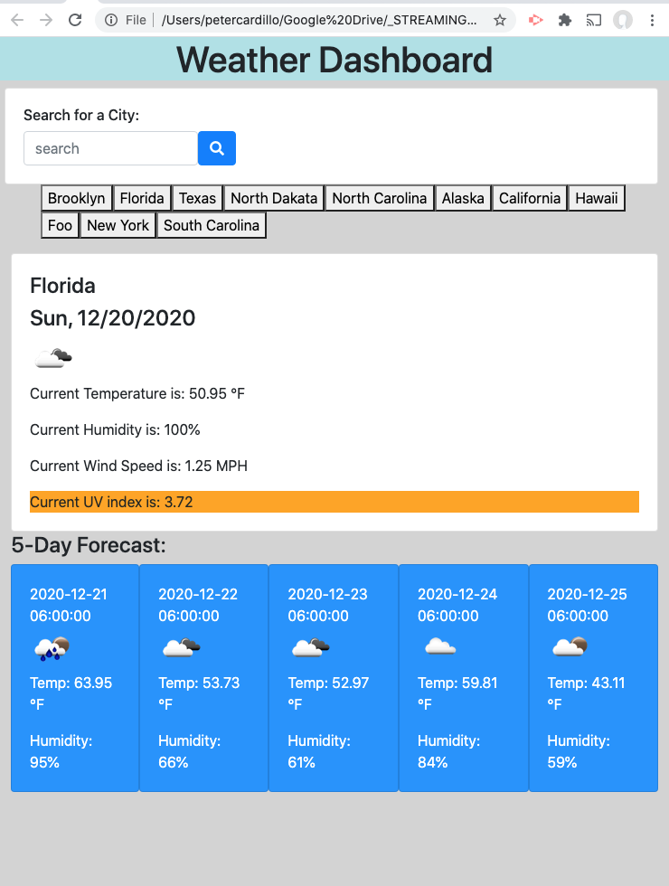
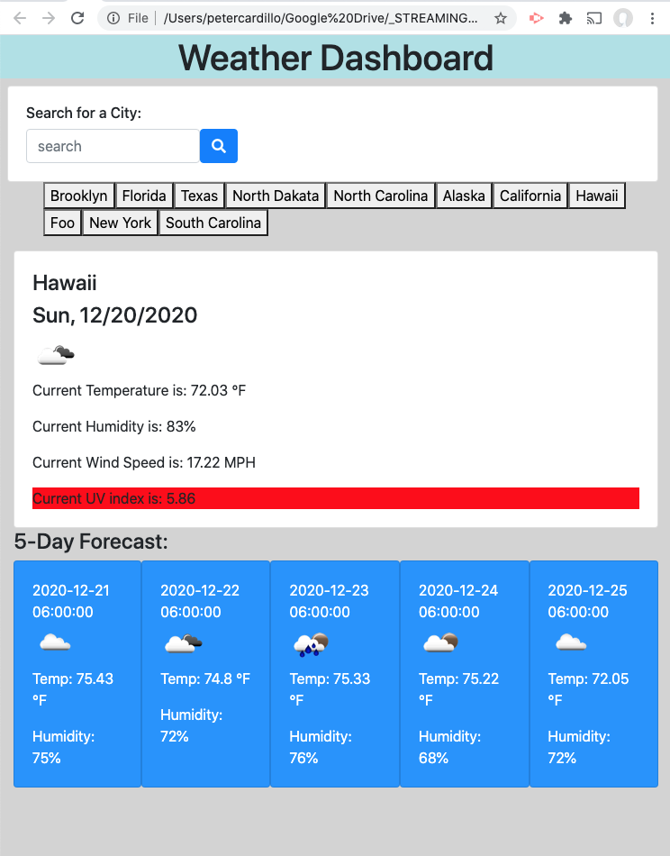

# 6-WeatherDashboardHW_PAC
# HW #6: Weather Dashboard
# Due: Saturday, December 19, 2020 @ 11:59pm Local

## User Story
1. This is a weather dashboard app that will show a five day weather forcast for the searched city.
2. The app will show the current day's Temperature, Humidity, Wind Speed & UV Index.
3. The five day forcast shows the Temp & Humidity for the 3:00pm hour.
4. Weather icons are shown for the current day as well as for each of the five days forcast.
5. The UV index is color highlighted to represent favoriable, moderate or severe exposure conditions.
6. Your searched cities are saved in localStorage for quick retrevial.
7. This application uses the following API's:
*  https://openweathermap.org
*  https://day.js.org/
*  https://getbootstrap.com/
*  https://jquery.com/download/
*  https://fontawesome.com
 
---
---
## Acceptance Criteria
1. Using form inputs, WHEN I search for a city, I am given the current and future conditons for that city and that city is added to the search history. (CONFIRMED)
2. Viewing current weather conditions for that city, I can see the city name, date & icon representation of the weather condition, temperature, humidity and UV index. (CONFIRMED)
3. Viewing the the UV index, I can determine if by the color if the exposure is favorable, moderate or severe. (CONFIRMED) 
   * UV Index Color Indicator is YELLOW (favorable)for index range (0 to 2.9)
   * UV Index Color Indicator is ORANGE (moderage) for index range (3 to 5)
   * UV Index Color Indicator is RED (severe)   for index range (5 to 10)
4. Viewing the future weather condition for a city, I am presented with a 5-day forcast, displaying the date, an icon representation of the weaher conditions, the temperature and humidity. (CONFIRMED)
5. Clicking on a city in the search history, I am again presented with the current and future condition for that city. (CONFIRMED)  

---
---
## Screen Shots of the Application:
* > Screenshot showing UV YELLOW indicator for FAVORIABLE conditions: 

* > Screenshot showing UV ORANGE indicator for MODERATE conditions: 

* > Screenshot showing UV RED indicator for SEVERE conditions: 

---
---
## gitHub repo link & live web link:
 

* `Application GitHub Repo URL:`
https://github.com/streamingTurtles/6-WeatherDashboardHW_PAC

* `Application Live GitHub URL:`  https://streamingturtles.github.io/6-WeatherDashboardHW_PAC/